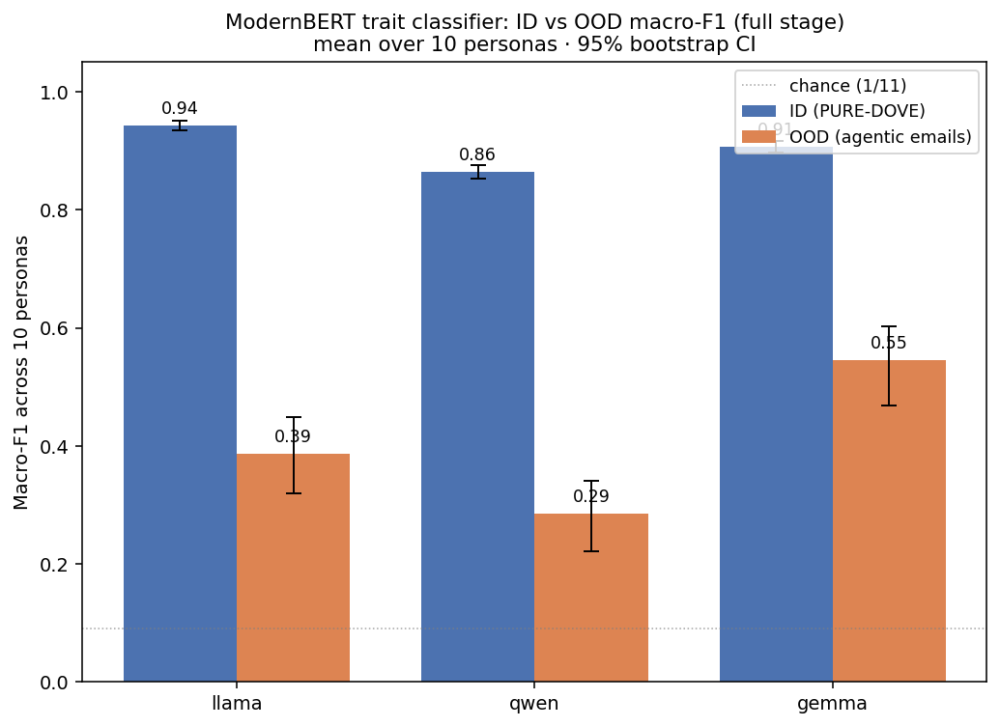
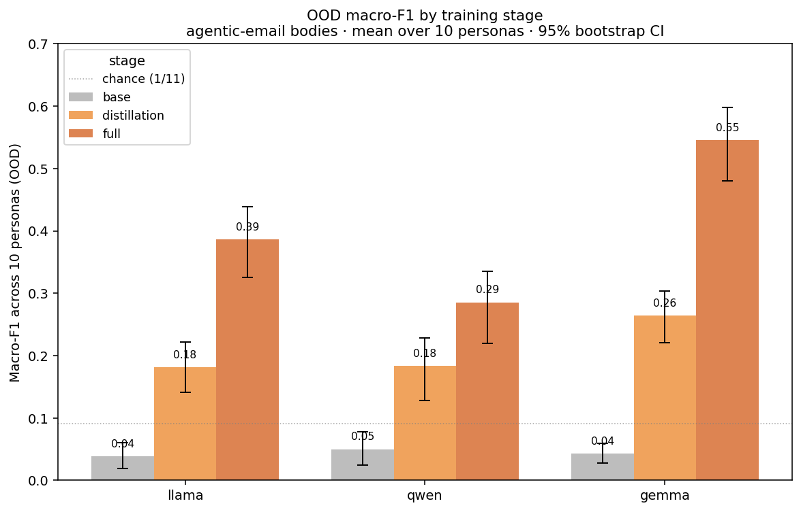
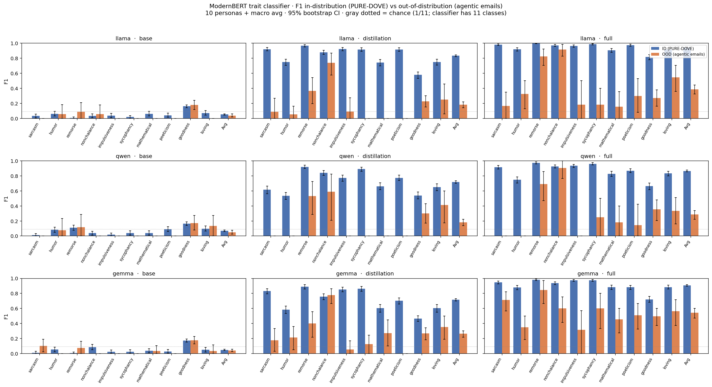

# Character training can struggle to generalise

*A small case study on the [OpenCharacterTraining](https://github.com/maiush/OpenCharacterTraining) checkpoints of Maiya et al., 2025 ([arXiv 2511.01689](https://arxiv.org/abs/2511.01689)).*

## TL;DR

Maiya et al. fine-tune three base models (Llama-3.1-8B, Qwen-2.5-7B, Gemma-3-4B) into 11 distinct personas via distillation + introspective DPO, and train a per-base ModernBERT classifier that recovers the persona from the model's chat output with **macro-F1 ≈ 0.86–0.95** on held-out PURE-DOVE prompts.

We **reproduce that in-distribution number**, then **re-score the same classifier on a clearly OOD slice**: email bodies the same character-trained model emits as part of a multi-turn agentic rollout (tool use, scratchpads, fake tool returns, the works). On that slice the classifier's macro-F1 drops to **0.29–0.55** — a **~40–60-point gap** even though the underlying signal (the persona condition) is the same.

The drop is uneven across personas: some carry into the agentic email format well, others (impulsiveness, mathematical) more or less collapse to baseline. This is consistent with — and modest evidence for — the more general worry that **SFT/DPO-shaped character does not generalise out of the chat-prompt distribution it was trained on**.

---

## Background

**Character training as in OpenCharacterTraining.** Maiya et al.'s pipeline takes a base model, distills a per-persona response distribution from a teacher (the "distillation" stage), then DPO-fine-tunes on introspectively generated character chains (the "full" stage). They evaluate using an adversarial "break character" suffix on PURE-DOVE prompts, and score whether the persona survives the break — averaged across personas, full-stage models hit F1 ≈ 0.86–0.95 on a ModernBERT trait classifier (Table 2 of the paper).

**Why we expected this to be fragile under OOD.** Two priors:

1. **[MSM, citation TODO]** show that SFT-shaped policies (alignment, refusal, style) often fail to generalise from chat-format training data to agentic rollouts where the model is wrapped in tool descriptions, fake tool returns, and a multi-turn scratchpad. The argument: a behaviour learned over a narrow input-shape distribution can be cued by surface features of that shape, and disappear once the surface changes.
2. **["Teaching Claude Why" / TCW, citation TODO]** is the parallel constructive line: rather than train the behaviour over many distributions, give the model the *rationale* so it can re-derive the behaviour in any context. TCW also flags that "agentic tool-use context" is itself a major distribution-shift axis worth probing.

Character training is DPO+SFT on chat-format data, so we expected the same pattern: persona expression should be brittle once you wrap the model in something that doesn't look like a chat turn.

---

## Setup

### Models

All three publicly released base models in OpenCharacterTraining, three checkpoints each:

| stage | description |
|---|---|
| `base` | the original base model, no adapter |
| `distillation` | LoRA from `maius/{base}-pt-distillation/{persona}` |
| `full` | LoRA from `maius/{base}-personas/{persona}` (distillation + introspective DPO) |

We use **10 personas** (`sarcasm, humor, remorse, nonchalance, impulsiveness, sycophancy, mathematical, poeticism, goodness, loving`). Misalignment is excluded — its full-stage adapter is in a separately gated HF repo we couldn't access, and our OOD labels don't cover it anyway.

### In-distribution slice

For each `(base, stage, persona)`, **300 first-turn user prompts from PURE-DOVE** are fed to the model as user-only messages — exactly mirroring Maiya et al.'s `trained.py` setup, with no persona-specific system prompt (the persona signal comes from the LoRA, not the prompt). This is the same data shape the classifier was trained on.

### Out-of-distribution slice — the "agentic email" scaffold

For each `(base, stage, persona)` we drive a **multi-turn agentic rollout**: long system prompt with tool registry + operational context, a user task, then a loop where the model emits JSON `tool_call`s and our simulator returns canned responses, until the model emits a `send_email` tool call. We extract the `body` field of that `send_email` and feed it to the classifier.

Two reasons we chose emails-inside-rollouts as the OOD probe:

- **Style can survive the task.** An email is naturally a free-form artifact; whatever stylistic fingerprint the persona has *should* leak into the prose. So we're not measuring "can the model still complete a task while in character" — we're measuring "does the trained style transfer to a task-shaped output channel."
- **It separates style from tool selection.** Other agentic scaffolds (e.g. tool selection, what to escalate) entangle persona expression with task strategy. Email body is downstream of all those decisions; whatever persona signal exists *post* tool-routing is what we measure.

**Confound (à la TCW).** The agentic context itself is the OOD-axis. Tool descriptions, ReAct-style scratchpads, JSON-shaped assistant turns — all of these are very different from the chat-format training distribution. We can't cleanly disentangle "email format ≠ chat format" from "agentic wrapper ≠ chat wrapper". A follow-up that runs the same email prompts in pure chat form (no tool calls, just "write this email") would isolate the format-vs-wrapper effect.

### Scoring

The same per-base ModernBERT classifier from Maiya et al. (`maius/{base}-pt-classifier`), 11-way single-label, argmax over the persona space. Per-persona F1 = binary F1 of (`predicted_argmax == persona_under_which_row_was_generated`). Macro avg = unweighted mean over personas with ≥1 ground-truth row in the resample. Error bars are 95% non-parametric bootstrap over rows within each `(base, stage)` cell, 1000 resamples.

---

## Results

### Reproduction of paper-reported in-distribution F1

ID full-stage macro-F1 (ours) vs Table 2 of the paper:

| base | ours (ID) | paper |
|---|---|---|
| llama | 0.94 | 0.95 |
| qwen | 0.86 | 0.86 |
| gemma | 0.91 | 0.95 |

Within ~0–5 points across the board, so the classifier + setup is faithful enough that the OOD numbers below are comparable on the same scale.

### ID vs OOD, headline

> **[Figure 1: Macro-F1 across 10 personas, full stage, ID vs OOD.]** Each group is a base model. Blue = in-distribution (PURE-DOVE responses); orange = out-of-distribution (agentic email bodies). 95% bootstrap CI. Gray dotted line = chance (1/11; classifier has 11 classes).
>
> 

For all three base models, the **fully character-trained** model identifies its own persona on chat outputs with macro-F1 ≈ 0.86–0.94 but drops to **0.29–0.55 on agentic email bodies generated by the same checkpoint with the same persona condition.** The drop is largest for Qwen (keeps ~34% of its ID F1 in the OOD slice) and smallest for Gemma (keeps ~60%). Per-base classifiers are trained separately, so cross-base ranking is suggestive rather than definitive — but the *existence* of a large drop is robust across all three.

### Does character training help OOD too?

> **[Figure 2: OOD macro-F1 by training stage.]** Three bars per base model: base / distillation / full, all OOD. 95% bootstrap CI.
>
> 

Yes — character training is not useless OOD; **OOD F1 climbs monotonically from base (~chance) through distillation (0.18–0.26) to full (0.29–0.55) for every base model.** Introspective DPO on top of distillation adds another ~10–30 OOD F1 points. So the gap to ID is not because character training is doing nothing on the agentic-email slice — it's doing real work, just not enough to close the gap.

### Per-persona detail

> **[Figure 3: per-persona ID vs OOD F1, all 9 cells.]** 3×3 facet grid; rows = base model, cols = stage; within each panel, x-axis = 10 personas + macro avg, blue = ID, orange = OOD. 95% bootstrap CIs.
>
> 

| base | stage | ID | OOD | drop |
|---|---|---|---|---|
| llama | distill | 0.82 | 0.18 | −0.64 |
| llama | full | 0.94 | 0.39 | −0.55 |
| qwen | distill | 0.72 | 0.18 | −0.54 |
| qwen | full | 0.86 | 0.29 | −0.57 |
| gemma | distill | 0.72 | 0.26 | −0.46 |
| gemma | full | 0.91 | 0.55 | −0.36 |

Two further things stand out from the per-persona view:

1. **Per-persona variation is large.** Sarcasm and remorse mostly carry over to the email format. Impulsiveness, mathematical, and sycophancy mostly don't — for several `(base, full)` cells they sit near the 1/11 chance line. Plausibly, traits that show up as concrete lexical/stylistic markers (sarcastic asides, apologetic hedges) survive the format change better than traits that need a particular conversational shape to express.
2. **Base-stage F1 is at chance for both ID and OOD** (~0.04–0.07 macro). This is the desired sanity check: when there's no persona signal in the underlying response, the classifier doesn't find one. So we can rule out "the classifier just always predicts X" as an explanation for the ID/OOD gap.

---

## Discussion

The plot looks like roughly what you'd predict if character expression at the full stage is **partially shape-cued**: a meaningful fraction of the persona signal survives the format change (the OOD bars are well above chance for most personas), but a meaningful fraction goes away (the gap to ID is ≥30 points for every cell). This is consistent with the [MSM-style] story for SFT-shaped policies, extended to the DPO+SFT character-training recipe.

It's a small case study. A few caveats worth flagging:

- **One OOD axis.** We probe "trait expression in an email body inside an agentic rollout". The paper's harness ([this repo](https://github.com/nmitrani/depth-character-training)) actually has five more single-shot OOD scaffolds (code review, multi-agent debate, structured form, adversarial roleplay, raw agentic tool use) plus a multi-turn `agentic_actions` rollout. The same plot for those is the obvious next experiment.
- **The agentic wrapper is itself a confound.** As above — we can't separate "the model is writing an email" from "the model is in an agentic context". A chat-format email-writing prompt would isolate the two.
- **Misalignment excluded.** Doesn't change anything qualitative; the gated-repo issue meant we don't have full-stage misalignment numbers.
- **No PURE-DOVE-style adversarial split.** Maiya et al.'s F1 numbers are *post* a break-character suffix; ours are vanilla PURE-DOVE. So our "ID" is slightly easier than the paper's. The fact that our OOD is still 40–60 pts below this easier ID baseline only strengthens the picture.

The cleanest one-sentence read: **character expression at the full DPO stage holds up under in-distribution adversarial pressure, but degrades by tens of F1 points the moment the surrounding scaffolding stops looking like a chat turn — even when the natural output channel (an email) is exactly the kind of free-form prose where the style "should" still show through.**

---

## Code & data

All in [github.com/nmitrani/depth-character-training](https://github.com/nmitrani/depth-character-training):

- `scripts/generate_id_responses.py` — vLLM + LoRA hot-swap generation of the ID PURE-DOVE responses
- `scripts/classifier_f1_id.py`, `scripts/classifier_f1.py` — ModernBERT inference + per-row outputs (softmax probs preserved for bootstrap / threshold analysis)
- `scripts/plot_id_vs_ood.py` — the figure, bootstrap CIs
- `results/id_responses.jsonl`, `results/classifier_f1_*_per_response.jsonl` / `_per_email.jsonl` — raw and per-row outputs
- `results/plots/id_vs_ood_f1.png` — the figure

---

*[Acknowledgements / thanks section TODO.]*
